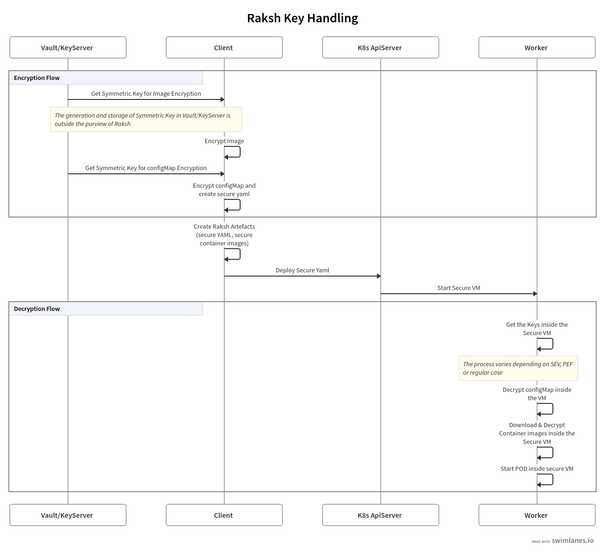

# Introduction
This doc describes the various secrets that are used by Raksh and which needs to be handled as part of the secure YAML generation workflow

Following are the types of secrets used in Raksh
1. Key to encrypt/decrypt the configMap
2. Key to encrypt/decrypt the container image

Note that Raksh doesn't explicitly handle application secrets. For example secrets that are passed as environment variables in the original application spec (pod.yaml/deploy.yaml etc).
This is because the application spec is encrypted before being sent to VM TEE and consequently decrypted inside the VM TEE. Hence we don't need to handle it separately.

# Generating the secrets
The two secrets (for configMap and container image) can be either generated locally by end user or retrieved from an external key server (eg. vault).
Raksh doesn't handle key generation and leaves it to established practices for the same.

# Referring to the secret in the secure application YAML
Following environment variables in the secure application YAML are used to refer to the secrets.

- **SC_CONFIGMAP_KEY** : AES 256 Symmetric Key for encrypting configmap (configMapKey)
- **SC_IMAGE_KEY**  : Private part of the asymmetric key used for container image encryption (imageKey).  

The following diagram describes the workflow

# Making the secrets available to the VM 
As mentioned above the secrets are held in two environment variables and provided to the VM.  How the environment variables gets populated in the case of VM TEE and non-TEE environments is described below:

## AMD SEV
Work in progress, stay tuned. 

## IBM PEF
The secrets are wrapped by the platform key (Key Encryption Key) and put in ESM blob which is attached to the VM initrd. IOW, the VM initrd has an encrypted blob containing the secrets. The private part of the platform keys are embedded in TPM of the PEF enabled servers.
On successful VM boot and attestation the secrets will be made available to the Raksh agent by the secure firmware. Raksh agent populates the environment variables with the decrypted secrets and proceeds with the rest of the workflow (decrypting spec, creating container etc).

## Regular Systems
For systems without support for VM TEEs, one can use existing mechanisms to provide secrets to PODs.
For example, K8s KMS provider can be leveraged. The secrets are wrapped by platform key (KEK) from the K8s KMS provider and mounted inside the VM. 
Another option without requiring K8s KMS provider is leveraging [secrets store CSI driver](https://github.com/kubernetes-sigs/secrets-store-csi-driver) for fetching the secrets and mounting it inside the VM.
Note that there is no runtime security of the secrets when not using VM based TEEs

The following diagram describes the PEF workflow

Details on the attestation process for AMD SEV and IBM PEF is thoroughly explained here - https://github.com/enarx/enarx/tree/master/docs/attestation